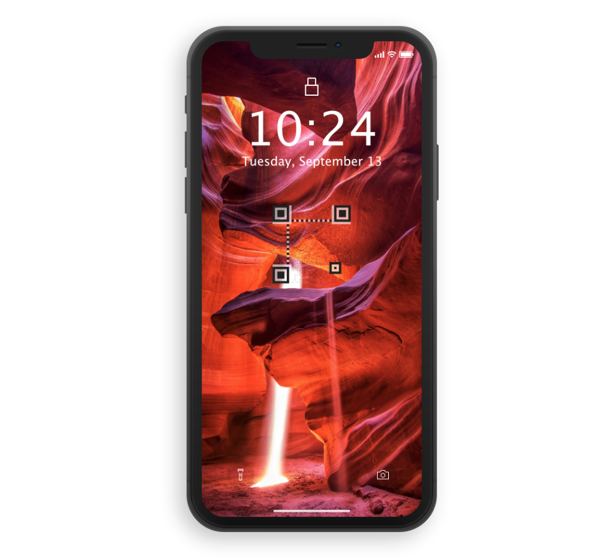

# AirCard
[![Contributors][contributors-shield]][contributors-url]
[![Forks][forks-shield]][forks-url]
[![Stargazers][stars-shield]][stars-url]

<!-- PROJECT LOGO -->

	<h3 align="center">AirCard</h3>
	

The next way to share your number and email ! Hand over your smartphone to your new contact and let them simply scan your wallpaper. 
	 
		<a href="https://github.com/aircard/aircard/issues">Report Bug</a>
		·
		<a href="https://github.com/aircard/aircard/issues">Request Feature</a>
	

 

<!-- ABOUT THE PROJECT -->
## About The Project

Phone numbers are very long and difficult to remember. Some people have very long email with unpronounceable nickname. AirCard will help you to share your number and email with other people without the hassle of spelling or writing your number.
Create your AirCard, choose your wallpaper, and a transparent QR code of your contact info will be added. Download it to your smartphone, and set it as a wallpaper. The next time you meet someone new, hand over your smartphone to them, and let them scan the code with their smartphone camera app (natively supported by all recent devices, no need of a third party app). Tada ! Now your friend will have your number and email without getting into a spelling nightmare !

<!-- ROADMAP -->
## Roadmap

See the [open issues](https://github.com/aircard/aircard/issues) for a list of proposed features (and known issues).

<!-- CONTRIBUTING -->
## Contributing

Contributions are what make the open source community such an amazing place to be learn, inspire, and create. Any contributions you make are **greatly appreciated**.

1. Fork the Project
2. Create your Feature Branch (`git checkout -b feature/AmazingFeature`)
3. Commit your Changes (`git commit -m 'Add some AmazingFeature'`)
4. Push to the Branch (`git push origin feature/AmazingFeature`)
5. Open a Pull Request

<!-- ACKNOWLEDGEMENTS -->
## Acknowledgements

Special thanks to :
* [Awesome QR library](https://github.com/SumiMakito/Awesome-qr.js) by Makito
* [Demo wallpaper](https://unsplash.com/photos/fJQamCZIZf8) by Dani García
* [iPhone X Lockscreen mockup](https://dribbble.com/shots/3803481--FREE-iPhone-X-Mockup) by Jae-seong, Jeong

Dani García
<!-- MARKDOWN LINKS & IMAGES -->
<!-- https://www.markdownguide.org/basic-syntax/#reference-style-links -->
[contributors-shield]: https://img.shields.io/github/contributors/aircard/aicard.svg?style=flat-square
[contributors-url]: https://github.com/aircard/aircard/graphs/contributors
[forks-shield]: https://img.shields.io/github/forks/aircard/aircard.svg?style=flat-square
[forks-url]: https://github.com/Aircard/aircard/network/members
[stars-shield]: https://img.shields.io/github/stars/aircard/aircard.svg?style=flat-square
[stars-url]: https://github.com/Aircard/aircard/stargazers
[issues-shield]: https://img.shields.io/github/issues/aircard/aircard.svg?style=flat-square
[issues-url]: https://github.com/Aircard/aircard/issues

### Disclaimer
This software/resource is provided "as is" without warranty of any kind, either expressed or implied and such software is to be used at your own risk. While it was created taking many aspects and factors in mind, the use of this software/resource is done at your own discretion and risk and with agreement that you will be solely responsible for any damage to your computer system or loss of data that results from such activities. No advice or information, whether oral or written, obtained by you from us shall create any warranty for the software/resource. Additionally, we make no warranty that: (a) This software/resource will meet your requirements, (b) This software/resource will be uninterrupted, timely, secure or error-free, (c) The results from the use of this software/resource will be effective, accurate or reliable, (d) The quality of this software/resource will meet your expectations, (e) If errors or problems occur in connection with a download of this software/resource obtained from the links on this website, they will be corrected.
